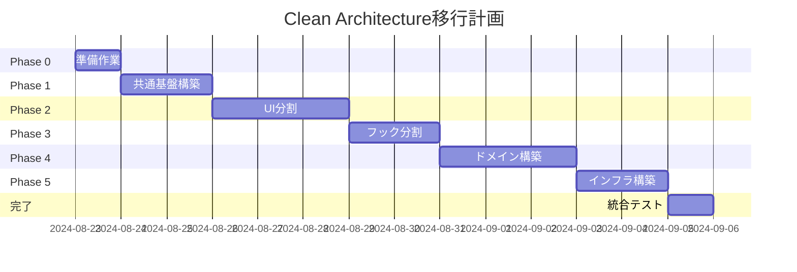

# UniVoice 2.0 Clean Architecture 移行計画書

## 📋 目次
1. [現状分析](#現状分析)
2. [アーキテクチャ設計](#アーキテクチャ設計)
3. [移行戦略](#移行戦略)
4. [リスク管理](#リスク管理)
5. [テスト戦略](#テスト戦略)
6. [実装計画](#実装計画)

## 🔍 現状分析

### 現在の問題点

#### 1. **ファイルサイズと責任の混在**
```
UniVoicePerfect.tsx (1800行+)
├── UI表示ロジック
├── 状態管理（20個以上のuseState）
├── イベントハンドリング
├── リサイズ処理
├── モーダル管理
├── 自動保存
├── キーボードショートカット
├── ローカルストレージ
├── タイマー管理
├── メモ機能
└── エクスポート機能
```

#### 2. **密結合の問題**
- UIとビジネスロジックが密結合
- イベント名がハードコード
- 親フォルダへの暗黙的な依存
- グローバルなwindowオブジェクトへの直接アクセス

#### 3. **テスタビリティの欠如**
- 巨大なコンポーネントはテストが困難
- モックが作りにくい
- 副作用が多い

### 既存の動作している機能（絶対に壊さない）

1. **コア機能**
   - リアルタイム音声認識表示 ✅
   - リアルタイム翻訳表示 ✅
   - 履歴への保存 ✅
   - 3行表示システム ✅

2. **高度な機能**
   - 定期要約生成 ⚠️（未完全実装）
   - 語彙抽出 ⚠️（未完全実装）
   - 最終レポート ⚠️（未完全実装）
   - 履歴のグループ化 🔴（課題）

3. **UI機能**
   - セクションのリサイズ
   - モーダル表示
   - 自動保存
   - キーボードショートカット

## 🏗️ アーキテクチャ設計

### レイヤー構造

```
┌─────────────────────────────────────────────────────────┐
│                    Presentation Layer                    │
│  - React Components (View)                              │
│  - Custom Hooks (Presenter)                            │
└────────────────────┬────────────────────────────────────┘
                     │
┌────────────────────▼────────────────────────────────────┐
│                  Application Layer                       │
│  - Use Cases                                           │
│  - Application Services                                │
└────────────────────┬────────────────────────────────────┘
                     │
┌────────────────────▼────────────────────────────────────┐
│                    Domain Layer                          │
│  - Entities                                            │
│  - Domain Services                                     │
│  - Domain Events                                       │
└────────────────────┬────────────────────────────────────┘
                     │
┌────────────────────▼────────────────────────────────────┐
│                Infrastructure Layer                      │
│  - External APIs (OpenAI, Deepgram)                   │
│  - IPC Communication                                   │
│  - Local Storage                                       │
└─────────────────────────────────────────────────────────┘
```

### ディレクトリ構造

```
UniVoice/
├── src/
│   ├── presentation/          # プレゼンテーション層
│   │   ├── components/        # UIコンポーネント
│   │   │   ├── UniVoice/
│   │   │   │   ├── UniVoiceContainer.tsx      (100行)
│   │   │   │   ├── sections/
│   │   │   │   │   ├── SetupSection/
│   │   │   │   │   │   ├── SetupSection.tsx   (150行)
│   │   │   │   │   │   ├── ClassSelector.tsx  (80行)
│   │   │   │   │   │   └── index.ts
│   │   │   │   │   ├── HistorySection/
│   │   │   │   │   │   ├── HistorySection.tsx  (120行)
│   │   │   │   │   │   ├── HistoryBlock.tsx   (80行)
│   │   │   │   │   │   └── index.ts
│   │   │   │   │   ├── RealtimeSection/
│   │   │   │   │   │   ├── RealtimeSection.tsx (150行)
│   │   │   │   │   │   ├── ThreeLineDisplay.tsx (100行)
│   │   │   │   │   │   └── index.ts
│   │   │   │   │   ├── SummarySection/
│   │   │   │   │   │   ├── SummarySection.tsx  (100行)
│   │   │   │   │   │   └── index.ts
│   │   │   │   │   └── QuestionSection/
│   │   │   │   │       ├── QuestionSection.tsx (120行)
│   │   │   │   │       ├── MemoEditor.tsx      (80行)
│   │   │   │   │       └── index.ts
│   │   │   │   ├── controls/
│   │   │   │   │   ├── SessionControls.tsx     (100行)
│   │   │   │   │   ├── ExportControls.tsx      (80行)
│   │   │   │   │   └── VolumeIndicator.tsx     (60行)
│   │   │   │   └── modals/
│   │   │   │       ├── HistoryModal.tsx        (100行)
│   │   │   │       ├── VocabularyModal.tsx     (80行)
│   │   │   │       └── ReportModal.tsx         (80行)
│   │   ├── hooks/             # カスタムフック
│   │   │   ├── core/
│   │   │   │   ├── usePipeline.ts             (80行)
│   │   │   │   ├── usePipelineEvents.ts       (100行)
│   │   │   │   └── usePipelineState.ts        (60行)
│   │   │   ├── ui/
│   │   │   │   ├── useResize.ts               (80行)
│   │   │   │   ├── useKeyboardShortcuts.ts    (60行)
│   │   │   │   ├── useAutoSave.ts             (60行)
│   │   │   │   └── useModal.ts                (40行)
│   │   │   └── audio/
│   │   │       ├── useAudioCapture.ts         (100行)
│   │   │       └── useVolumeLevel.ts          (60行)
│   ├── application/           # アプリケーション層
│   │   ├── usecases/
│   │   │   ├── StartSessionUseCase.ts         (80行)
│   │   │   ├── StopSessionUseCase.ts          (60行)
│   │   │   ├── TranslateTextUseCase.ts        (80行)
│   │   │   ├── GenerateSummaryUseCase.ts      (80行)
│   │   │   └── ExportDataUseCase.ts           (100行)
│   │   └── services/
│   │       ├── SessionService.ts              (100行)
│   │       ├── HistoryService.ts              (100行)
│   │       └── StorageService.ts              (80行)
│   ├── domain/                # ドメイン層
│   │   ├── entities/
│   │   │   ├── Session.ts                     (60行)
│   │   │   ├── Translation.ts                 (40行)
│   │   │   ├── Summary.ts                     (40行)
│   │   │   └── HistoryEntry.ts                (40行)
│   │   ├── services/
│   │   │   ├── TranslationService.ts          (80行)
│   │   │   └── SummaryService.ts              (80行)
│   │   ├── events/
│   │   │   ├── DomainEvent.ts                 (40行)
│   │   │   ├── SessionEvents.ts               (60行)
│   │   │   └── TranslationEvents.ts           (60行)
│   │   └── repositories/
│   │       ├── ISessionRepository.ts          (40行)
│   │       └── IHistoryRepository.ts          (40行)
│   ├── infrastructure/        # インフラストラクチャ層
│   │   ├── api/
│   │   │   ├── ElectronIPCAdapter.ts          (100行)
│   │   │   └── WindowAPIAdapter.ts            (80行)
│   │   ├── storage/
│   │   │   ├── LocalStorageAdapter.ts         (80行)
│   │   │   └── IndexedDBAdapter.ts            (100行)
│   │   └── repositories/
│   │       ├── SessionRepository.ts           (100行)
│   │       └── HistoryRepository.ts           (100行)
│   └── shared/                # 共有
│       ├── constants/
│       │   ├── events.ts                      (80行)
│       │   └── config.ts                      (40行)
│       ├── types/
│       │   └── contracts.ts                   (100行)
│       └── utils/
│           ├── EventBus.ts                    (80行)
│           └── Logger.ts                      (60行)
```

## 🔄 移行戦略

### Phase 0: 準備（1日）

1. **バックアップブランチの作成**
   ```bash
   git checkout -b backup/before-clean-architecture
   git push origin backup/before-clean-architecture
   ```

2. **現状のE2Eテスト作成**
   ```typescript
   // tests/e2e/current-functionality.test.ts
   describe('現在の機能', () => {
     test('リアルタイム音声認識が表示される', async () => {
       // 実装
     });
     test('リアルタイム翻訳が表示される', async () => {
       // 実装
     });
     test('履歴に保存される', async () => {
       // 実装
     });
   });
   ```

3. **課題記録ファイルの作成**
   ```markdown
   # docs/MIGRATION-ISSUES.md
   - 発見した課題を随時記録
   ```

### Phase 1: 共通基盤の構築（2日）

1. **イベント定数の一元化**
   ```typescript
   // src/shared/constants/events.ts
   export const PIPELINE_EVENTS = {
     CURRENT_ORIGINAL_UPDATE: 'current-original-update',
     CURRENT_TRANSLATION_UPDATE: 'current-translation-update',
     TRANSLATION_COMPLETE: 'translation-complete',
     // ... 全イベントを定義
   } as const;
   ```

2. **型安全なEventBusの実装**
   ```typescript
   // src/shared/utils/EventBus.ts
   export class TypedEventBus<TEvents extends Record<string, any>> {
     // 実装
   }
   ```

3. **依存性注入コンテナの準備**
   ```typescript
   // src/shared/di/container.ts
   export class DIContainer {
     // 実装
   }
   ```

### Phase 2: UIコンポーネントの分割（3日）

1. **UniVoicePerfect.tsxの分析**
   - 責任の識別
   - 状態の分類
   - イベントハンドラの整理

2. **段階的な抽出**
   ```bash
   # Step 1: SetupSectionを抽出
   git checkout -b refactor/extract-setup-section
   # テスト実行
   npm test
   # コミット
   git commit -m "refactor: extract SetupSection component"
   ```

3. **各セクションの抽出順序**
   1. SetupSection（独立性が高い）
   2. RealtimeSection（コア機能）
   3. HistorySection（課題あり、慎重に）
   4. SummarySection
   5. QuestionSection

### Phase 3: カスタムフックの分割（2日）

1. **useUnifiedPipelineの分析**
   - コア機能の識別
   - イベント処理の分離
   - 音声処理の分離

2. **段階的な抽出**
   ```typescript
   // Step 1: イベント処理を分離
   // src/presentation/hooks/core/usePipelineEvents.ts
   export const usePipelineEvents = () => {
     // イベント処理のみ
   };
   ```

### Phase 4: ドメインサービスの構築（3日）

1. **エンティティの定義**
   ```typescript
   // src/domain/entities/Translation.ts
   export class Translation {
     constructor(
       public readonly id: string,
       public readonly original: string,
       public readonly translated: string,
       public readonly timestamp: number
     ) {}
   }
   ```

2. **ドメインサービスの実装**
   ```typescript
   // src/domain/services/TranslationService.ts
   export class TranslationService {
     // ビジネスロジックのみ
   }
   ```

### Phase 5: インフラストラクチャ層の構築（2日）

1. **アダプタの実装**
   ```typescript
   // src/infrastructure/api/ElectronIPCAdapter.ts
   export class ElectronIPCAdapter implements IPipelineAPI {
     // IPC通信の実装
   }
   ```

2. **リポジトリの実装**
   ```typescript
   // src/infrastructure/repositories/HistoryRepository.ts
   export class HistoryRepository implements IHistoryRepository {
     // 永続化の実装
   }
   ```

## 🛡️ リスク管理

### リスクと対策

| リスク | 影響度 | 発生確率 | 対策 |
|--------|--------|----------|------|
| 既存機能の破壊 | 高 | 中 | 段階的移行、E2Eテスト |
| パフォーマンス劣化 | 中 | 低 | プロファイリング、最適化 |
| 複雑性の増加 | 中 | 中 | シンプルな設計、ドキュメント |
| 開発期間の延長 | 中 | 高 | 優先順位付け、段階的リリース |

### バックアップ戦略

1. **Gitブランチ戦略**
   ```
   main
   ├── backup/before-clean-architecture
   ├── refactor/phase-1-common
   ├── refactor/phase-2-ui
   ├── refactor/phase-3-hooks
   ├── refactor/phase-4-domain
   └── refactor/phase-5-infra
   ```

2. **ロールバック手順**
   - 各フェーズ完了時にタグ付け
   - 問題発生時は前のタグに戻る
   - データベースのマイグレーションは別管理

## 🧪 テスト戦略

### テストピラミッド

```
         /\
        /  \  E2E Tests (10%)
       /____\
      /      \  Integration Tests (30%)
     /________\
    /          \  Unit Tests (60%)
   /____________\
```

### テストの種類と目的

1. **単体テスト**
   - 各モジュールの機能を検証
   - モックを使用して独立性を保つ
   - 実行時間: < 10秒

2. **統合テスト**
   - モジュール間の連携を検証
   - 実際のAPIは使わない
   - 実行時間: < 1分

3. **E2Eテスト**
   - ユーザーシナリオを検証
   - 実際の環境で実行
   - 実行時間: < 5分

### テスト実行タイミング

- **コミット時**: 単体テスト
- **PR作成時**: 単体テスト + 統合テスト
- **マージ前**: 全テスト

## 📅 実装計画

### タイムライン（合計: 約2週間）



### マイルストーン

1. **M1**: 共通基盤完成（Day 3）
2. **M2**: UI分割完了（Day 6）
3. **M3**: ビジネスロジック分離（Day 11）
4. **M4**: 全体統合完了（Day 14）

## 📊 成功指標

1. **コード品質**
   - 各ファイル200行以下
   - 循環依存ゼロ
   - テストカバレッジ80%以上

2. **パフォーマンス**
   - 初期表示時間: 変化なし
   - メモリ使用量: 10%以下の増加

3. **保守性**
   - 新機能追加時間: 50%削減
   - バグ修正時間: 30%削減

## 🚦 開始条件

1. ステークホルダーの承認
2. 現在の機能の完全な動作確認
3. バックアップの作成
4. E2Eテストの準備

## 📝 注意事項

1. **履歴のグループ化問題**は一旦保留
2. **親フォルダとの互換性**は維持
3. **段階的な移行**を徹底
4. **毎日の進捗レビュー**を実施

---

最終更新: 2024-08-22
作成者: Claude (Ultrathink)
レビュー: 未実施