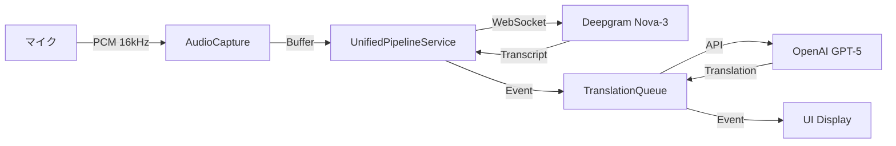

# UniVoice コードベース深層分析レポート
作成日: 2025-09-26
作成者: Claude Code (DEEP THINK モード)

## 全体構造

### アーキテクチャ概要

UniVoice は Clean Architecture + CQRS + Event-Driven パターンで構築されたリアルタイム音声翻訳アプリケーションです。

```
UniVoice/
├── electron/              # バックエンド処理層
│   ├── main/             # ウィンドウ管理
│   ├── services/         
│   │   ├── domain/       # ドメインロジック
│   │   ├── ipc/          # 型安全IPC（Zod）
│   │   └── adapters/     # 外部サービスアダプタ
│   └── infrastructure/   # LLMゲートウェイ
└── src/                   # フロントエンドUI層
    ├── domain/           # ドメインモデル
    ├── hooks/            # Reactフック
    ├── components/       # UIコンポーネント
    └── presentation/     # プレゼンテーション層
```

## データフロー分析

### 1. 音声入力から翻訳出力まで



### 2. イベントフロー

1. **ASRイベント**: Deepgramからの音声認識結果
2. **Translationイベント**: OpenAIからの翻訳結果
3. **CombinedSentenceイベント**: 文単位で結合されたテキスト
4. **ProgressiveSummaryイベント**: 段階的要約（400/800/1600/2400語）

### 3. 重要なコンポーネント

#### UnifiedPipelineService (1648行)
- **役割**: 中核的なパイプライン管理
- **問題点**: 
  - TranscriptSegment が2回定義されている（48行目、94行目）
  - handleTranscriptSegmentOLD が削除されずに残っている
  - translationComplete イベントが japanese プロパティをハードコード

#### useUnifiedPipeline (1223行)
- **役割**: React側のメインフック
- **問題点**:
  - Translation 型が japanese プロパティを持つ
  - original/translation と source/target が混在
  - displayPairs では original.text と translation.text を使用

#### TranslationQueueManager (227行)
- **役割**: 翻訳リクエストの並列制御
- **特徴**: 
  - 最大3つの同時翻訳
  - 優先度制御（high/normal/low）
  - originalText/sourceLanguage/targetLanguage を使用

#### SentenceCombiner (265行)
- **役割**: 文単位でのテキスト結合
- **問題点**: TranscriptSegment を独自定義

## 発見された重要な問題

### 1. 技術的負債

1. **型定義の重複** - DRY原則違反
2. **命名規則の不統一** - コードの可読性低下
3. **言語固定の問題** - 拡張性の欠如
4. **スタブ実装の存在** - TextUpdateManager など

### 2. アーキテクチャ上の問題

1. **コントラクトの不整合**
   - contracts.ts は詳細な型定義
   - src/shared/types/contracts.ts は `data: any` で簡略化

2. **レイヤー間の依存**
   - electron 側と src 側で型定義が重複
   - 明確な境界がない

### 3. パフォーマンス上の懸念

1. **StreamBatcher の削除**
   - UNIVOICE-REFACTORING-MAPPING-20250925.md で指摘
   - ストリーミング更新の非効率化

2. **確定時間の変更**
   - 原文: 800ms → 80ms（10倍速い）
   - 翻訳: 1000ms → 100ms（10倍速い）
   - 意図不明の変更

## アクションアイテム

### 緊急度: 高

1. **スタブ実装の完成**
   - TextUpdateManager の実装
   - テストコードの追加

2. **型定義の一元化**
   - 共通型定義ファイルの作成
   - import の整理

### 緊急度: 中

3. **命名規則の統一**
   - source/target への移行
   - テストの実施

4. **言語固定の解消**
   - english/japanese → sourceText/targetText
   - API契約の更新

### 緊急度: 低

5. **パフォーマンス最適化**
   - StreamBatcher の復活検討
   - 確定時間の見直し

## 結論

UniVoice は基本的なアーキテクチャは優れていますが、実装の品質にバラツキがあります。

特に以下の点が懸念されます：

1. **急速な成長に伴う技術的負債**
2. **Clean Architecture の実装が不完全**
3. **テストカバレッジの不足**

しかし、これらはすべて修正可能な問題であり、適切なリファクタリングで解決できます。

---

### 参考資料

1. [UNIVOICE-REFACTORING-MAPPING-20250925.md](./UNIVOICE-REFACTORING-MAPPING-20250925.md)
2. [NAMING-CONSISTENCY-ISSUES-20250926.md](./NAMING-CONSISTENCY-ISSUES-20250926.md)
3. [ARCHITECTURE.md](./ARCHITECTURE.md)